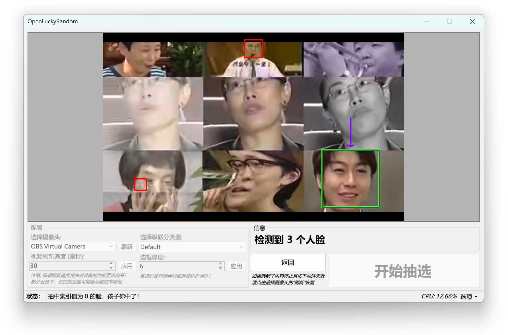

#  OpenLuckyRandom

启发于某沃一体机中的 LuckyRandom 人脸识别随机抽人，使用 WinForms 开发的玩具

与某沃一样采用了 `OpenCvSharp4`，都是用 C# 编写，只不过他们开发的版本使用到了 XAML Islands + WPF, 并且人脸识别上也没有使用本项目使用的 Haar 级联分类器......

可以给带有摄像头的旧某沃一体机或者带有摄像头的鸿某一体机随机抽人使用 (逃

本项目使用了 Qwen 协助开发, 当然还有 CodeGeeX 令人头疼的逆天乱补

## 特点

- 允许切换包括虚拟摄像头在内的摄像头（原版读不到不使用驱动实现的虚拟摄像头）
- 有一定的灵活性（能自己选择级联分类器，最重要的是开源）
- 更小的体积（相比原版而言，体积约是原版的 2/3）
- 支持大多数 Windows 设备而非限于某沃一体机（虽然原版提取出来以后也可以在其他设备运行）
- 支持 Windows 7（仅限使用 `.NET 6` 时, 原版由于 XAML Islands 只能在 Windows 10 1903 及更高版本使用）
- 更高版本的 .NET 支持（原版使用的是 `.NET Core 3.1`，虽然反编译并解决一下 WinRT 问题也可以升级）

## 相比原版的问题

- 原版综合占用较低，本项目占用较高（估计有答辩代码）

## 截图

*注: OBS Virtual Camera 正在播放的视频来自[此处](https://www.bilibili.com/video/BV1ex411P7Kc) (本项目仅使用该视频用于测试，与本程序无关)*

## 须知

使用本软件前请事先安装好 `.NET 6 桌面运行时` ，您可以点击[此处](https://dotnet.microsoft.com/zh-cn/download/dotnet/6.0)直接前往下载！

针对个人信息问题无需担心，本程序完全本地运行，不经过云端服务器！

## 开发

本项目使用到了 `.NET 6` ，进行开发前请安装对应 SDK，您也可以升级 SDK 版本到 `.NET 8` 或更新版本！

推荐直接使用 Visual Studio 或者 JetBrains Rider 进行开发

如果愿意，您也可以尝试将本项目向下移植到较为老旧的 `.NET Framework` 上 (一般推荐直接使用最新的 `.NET`)

## 许可证

本项目使用 **Apache 2.0** 许可证开源，OpenCV 可能还是用了使用 LGPL 的许可证开源的程序

